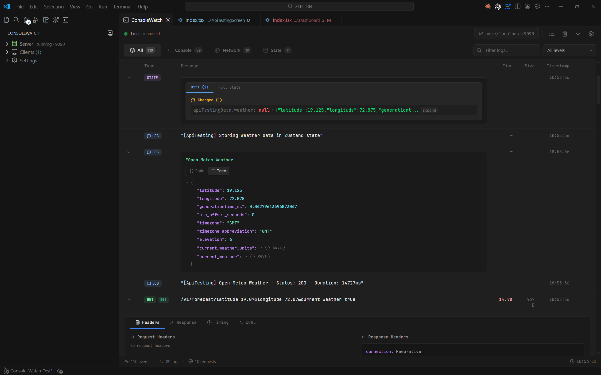
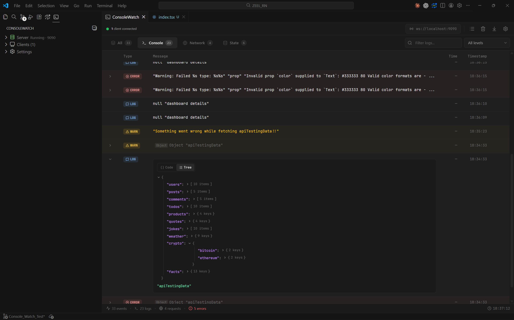
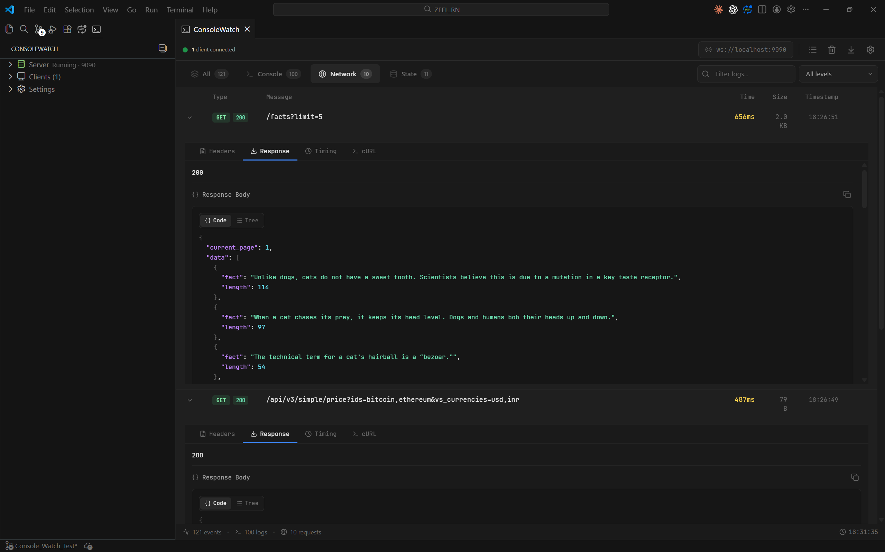
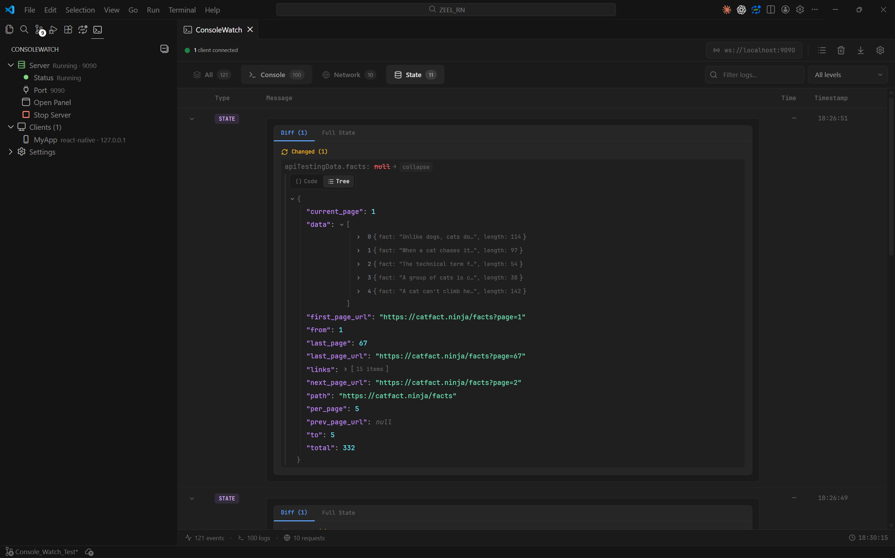

# ConsoleWatch

**Real-time debugging & observability for any app — right inside VS Code.**

No packages. No dependencies. One file. Full control.

ConsoleWatch is a platform-agnostic debugging console that streams logs, network activity, state changes, and custom events from your running apps directly into a beautiful VS Code panel. It works with **React, React Native, Flutter, Android, iOS, Node.js** — anything that can open a WebSocket.



---

## Features

### Console — Logs, Errors, Warnings in Real Time

Filter and inspect every `console.log`, `console.warn`, and `console.error` as they happen. Expand any log to see the full payload with a collapsible JSON tree — raw or formatted.



### Network Inspector — Requests at a Glance

Inspect every HTTP request your app makes. See URL, method, status code, response time, and size. Drill into **Headers**, **Response body**, **Timing**, and even copy as **cURL** — all without leaving VS Code.



### State Tracking With Diffs

Track state changes with automatic diff detection. See exactly what changed, when it changed, and the full state snapshot at any point — with tree and raw JSON views.



### Multi-App Debugging

Connect multiple running apps at the same time. The sidebar shows every connected client so you can debug your frontend, backend, and mobile app in one place.

---

## Quick Start

### 1. Install the Extension

Search for **ConsoleWatch** in the VS Code Marketplace, or install from the command line:

```bash
code --install-extension consolewatch.consolewatch
```

### 2. Open the Panel

Press `Ctrl+Shift+C` (Mac: `Cmd+Shift+C`) or run **ConsoleWatch: Open Panel** from the Command Palette.

### 3. Add the Client File to Your App

Download the client file and drop it into your project — no npm install, no config, just one file.

- [consolewatch-client.ts](client/consolewatch-client.ts) — Full TypeScript client

Here's an example using **React Native** with Zustand state tracking, imported at the app entry point (`index.js`):

```js
import App from "./App";
import { name as appName } from "./app.json";
import useStore from "./app/store";
import consolewatch from "./consolewatch-client";

import { AppRegistry } from "react-native";

consolewatch.trackStores({
  AppStore: useStore,
});

AppRegistry.registerComponent(appName, () => App);
```

The client auto-connects to `ws://localhost:9090` and starts streaming console logs, network requests, and state changes to the ConsoleWatch panel.

### 4. Run Your App

You'll see **"Connected"** in the ConsoleWatch panel. Logs, network requests, and state changes appear instantly.

---

## How It Works

```
Your App  ──WebSocket──▶  VS Code Extension  ──postMessage──▶  Webview UI
              (9090)          (Extension Host)                  (React + Zustand)
```

1. Your app imports a tiny client file that patches `console.*`, `fetch`, and your state library
2. Events are sent over WebSocket to the ConsoleWatch server running inside VS Code
3. The extension routes events to a React-powered webview with tabs for All / Console / Network / State

---

## Configuration

| Setting | Default | Description |
|---|---|---|
| `consolewatch.port` | `9090` | WebSocket server port (1024–65535) |
| `consolewatch.host` | `localhost` | Bind address (`localhost` or `0.0.0.0` for LAN) |
| `consolewatch.maxConnections` | `10` | Max simultaneous client connections |
| `consolewatch.maxEvents` | `1000` | Max events kept in memory |
| `consolewatch.autoStart` | `true` | Auto-start the server on activation |

---

## Commands

| Command | Shortcut | Description |
|---|---|---|
| ConsoleWatch: Open Panel | `Ctrl+Shift+C` | Open the main debugging panel |
| ConsoleWatch: Clear All Events | — | Clear all captured events |
| ConsoleWatch: Toggle Server | — | Start or stop the WebSocket server |
| ConsoleWatch: Open Settings | — | Jump to extension settings |

---

## Supported Platforms

ConsoleWatch is **platform-agnostic**. If your runtime can send messages in the ConsoleWatch format, it works.

- React & Next.js
- React Native (iOS & Android)
- Flutter
- Node.js / Express / Fastify
- Android (Kotlin/Java)
- iOS (Swift)
- Electron
- Any WebSocket-capable environment

---

## License

MIT
